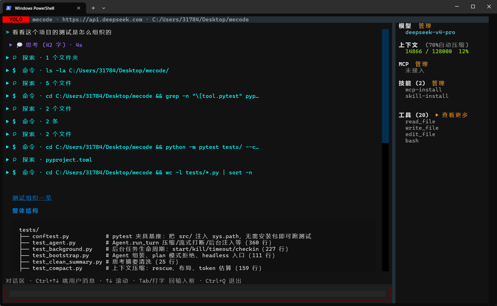
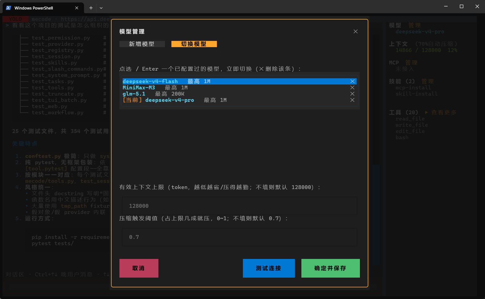

# mecode


**面向国产模型生态的、可读可学的 coding agent harness。**

用 Python 从零手写一套完整的 agent 框架——不是 demo,是把 Claude Code 这类产品的每一块"脊椎"都亲手造一遍:agent 主循环、流式解析、上下文压缩、会话持久化、工具权限、MCP、子 agent、后台任务、跨会话记忆、多模型思考链适配、skill 系统、workflow 编排。两个界面(终端 TUI / 浏览器桌面端)共用同一个内核。

**2.5 万行,行行读得过来**(核心 ~6,600 + 入口层 ~7,100 + 桌面端前端 ~2,800 + 测试 ~8,700)。每个子系统的注释写的不是"这行干了什么",而是**为什么这么设计、别的方案为什么不行**。

> 有人拆完泄露的 51 万行 Claude Code 源码后结论是:"值得看,不值得研究"——因为不完整、跑不起来、无法调试。mecode 想站的位置恰好是**值得研究**:小一个量级、全部可跑、可断点、每处取舍有注释。



## 为什么值得看

### 1. 国产思考模型的多轮适配(全网稀缺)

大多数开源 harness 只伺候 OpenAI/Anthropic 协议。mecode 对 **Kimi / DeepSeek / GLM / MiniMax** 四家的思考(reasoning)模型做了逐家实测适配:

| 模型 | thinking 开关 | "开"值 | 深度档 | 历史思考回传 |
|---|---|---|---|---|
| kimi-k2.7-code / -highspeed | 强制开 | enabled + keep=all | — | 每轮都带 |
| kimi-k2.6 | 可开关 | enabled + keep=all | — | 每轮都带 |
| deepseek-v4-flash / pro | 可开关 | enabled | high / max | 仅工具调用回合 |
| glm-5.2(5.1/5/turbo 无深度档) | 可开关 | enabled | high / max | 仅工具调用回合 |
| MiniMax-M3(M2.7 强制开) | 可开关 | **adaptive** | — | 每轮都带 |

这里面全是文档没写清、只能实测的坑,比如:

- **MiniMax 双发**:`reasoning_split=True` 时同一份思考**同时**从 `reasoning_content` 和 `reasoning_details` 发出(字节相同),两个都读会显示两遍
- **DeepSeek 纯答案回合回传 reasoning_content 会 400**,工具调用回合又必须带
- 最终架构:**统一 `reasoning_content` 单载体 + "存全、发时过滤"**——思考无条件落盘(transcript 是完整事实),发送前由 provider 按各家档案浅拷贝过滤。切模型、来回切、跨模型续会话,CoT 无损且不 400

实现:`registry.py`(ThinkingProfile 能力档案)+ `provider.py`(`_filter_reasoning` 发送闸)。

### 2. 上下文压缩(对齐 Claude Code 的设计)

- **压缩先于 append**:当前问题永远不会被卷进摘要
- 末轮对话硬保留、最近 N 个 read 的文件原文救援(摘要写丢了模型还能看到代码)
- 工具大输出入场截断 + 全文外置落盘(bash 留尾、grep 留头,含指针供模型回看)
- 上下文上限 = min(模型窗口, CAP=128K)——1M 窗口的模型不该泡在长上下文退化区里干活

实现:`compact.py` + `agent.py`。

### 3. 两个界面,一个内核(终端 / 浏览器)

`mecode` 开 TUI,`mecode desk` 开桌面端——同一个 Agent、同一套事件流(`events.py`),只是渲染在两个地方。桌面端**零新依赖**:stdlib 的 `ThreadingHTTPServer` + SSE 下行 + POST 上行,不引 Web 框架;前端也没有构建步骤,几个静态文件直接开。

两处值得看:

- **信任闸**(三道缺一不可)。服务监听本地端口、且桌面端必然跑在 auto/yolo 档——等于本机任何进程都能驱动 agent 跑任意 bash。浏览器的同源策略也拦不住:跨域 POST 属于简单请求,不触发预检就能发出去,一个恶意网页就能远程操纵你的 agent。所以:启动时生成随机 token 注入进 index.html(**首页本身也要拦**,放行等于把 token 白送)+ Host 头必须是回环地址(挡 DNS rebinding)+ Origin 校验(挡跨站请求)。**只绑 127.0.0.1 本身不够**——同机的其它程序照样连得上。
- **阻塞往返**。`ask_permission` 是 agent 工作线程上的**同步阻塞调用**,而答复得经过一趟浏览器再回来;"服务端向客户端发起请求"在 HTTP 里没有现成形状。做法:待答复请求登记成表 → 工作线程在 `Event` 上等 → SSE 把请求推给前端 → 前端 POST 回来唤醒。前端新连上时**重放未答复的请求**——刷新页面后那张审批窗必须回来,否则工作线程还在等、用户却看不到任何可点的东西。

实现:`scripts/deskserve.py` + `desktop/`。

### 4. 完整的子系统,每块都能单独读

| 子系统 | 文件 | 一句话 |
|---|---|---|
| Agent 主循环 | `agent.py` | 模型↔工具循环、防跑飞、空响应重试、协作式打断、连续只读工具并发执行 |
| Provider | `provider.py` | SSE 流解析、工具调用跨片拼接、退避重试、思考发送闸、4xx 人话映射 |
| 会话持久化 | `session.py` | transcript 单一真相、两种读法(API 工作记忆 vs 人类全量历史)、/rl /rs 续会话 |
| 工具权限 | `permission.py` | allow/deny/ask 三态 + 项目级持久化 + 路径逃逸防护(9 轮对抗红队收敛) |
| 运行模式 | `mode.py` | normal/auto/plan/yolo = 权限预设 + 每轮 reminder 注入(不进 system prompt,不击穿缓存) |
| Skill 系统 | `skills.py` | 渐进式披露:索引常驻 system prompt、全文按需读;三级发现目录、启停管理 |
| workflow 编排 | `workflow.py` | 声明式 JSON 编排多个子 agent:扇出/汇合、失败继续、后台跑 |
| 子 agent | `subagent.py` | 派生干净上下文的子 agent 并发跑子任务、只回总结 |
| MCP | `mcp.py` | stdio JSON-RPC 客户端,外部工具接进同一个注册表;并发连接、每 server 超时可调 |
| 后台任务 | `background.py` | bash 转后台、输出落文件、完成自动接续、定时 check-in |
| 跨会话记忆 | `memory.py` | 文件+索引、save/recall 工具、system prompt 注入索引 |
| 任务清单 | `tasks.py` | Task 模型(非整表覆盖)、侧栏实时刷新 |
| edit 容错级联 | `tools.py` | 六级替换器:精确 → 行修剪 → 转义归一 → 缩进弹性 → 空白归一 → 块锚点(越保物理结构越靠前) |
| 联网工具 | `web.py` | web_search 搜索 + web_fetch 抓页转可读文本 |
| headless 入口 | `bootstrap.py` + `cli.py` | build_agent() 工厂、Agent.ask()、全局 `mecode` 命令——程序也能用,不只人能用 |
| 模型配置 | `config.py` + `registry.py` | config.json 单一真相源、/config 可视化配置、热切换(不重启) |
| TUI | `scripts/tui.py` | textual 终端界面:流式渲染、工具批折叠、审批弹窗、可拖侧栏 |
| 桌面端 | `scripts/deskserve.py` + `desktop/` | 本地 HTTP 服务(SSE 下行 + POST 上行,零新依赖)+ 浏览器界面:Markdown 渲染、工具卡片、设置面板(模型/技能/MCP)、多工作区、随机 token 信任闸 |

629 个测试(pytest)+ 216 个前端自检(node,无浏览器),覆盖每个子系统的关键不变量。

## 整体架构

```
  人机入口                         程序入口 (headless)
  tui.py       (textual 终端)     from mecode import build_agent
  deskserve.py (浏览器桌面端)     mecode -p "..."  (脚本 / CI)
  chat.py      (CLI REPL)
      │                           │
      └──────────────┬────────────┘
                     │  事件流 (events.py)
             ┌───────▼────────┐
             │  Agent 主循环  │   agent.py: 模型 ↔ 工具,循环到收敛
             └───┬────────┬───┘   防跑飞 / 打断 / 只读工具并行
                 │        │
      provider.py│        │permission.py × mode.py
      SSE 流解析 │        │权限闸 allow/deny/ask
      思考发送闸 │        │normal/auto/plan/yolo
         ┌───────▼───┐  ┌─▼────────────────────────────┐
         │  模型后端 │  │  ToolRegistry (tools.py)     │
         │ Kimi / DS │  │  read/edit/bash/grep/glob    │
         │ GLM / MM  │  │  subagent · workflow · todo  │
         └───────────┘  │  web · 记忆 · 后台 · MCP     │
                        └──────────────────────────────┘
  横切: compact.py 压缩 · session.py 持久化 · skills.py 技能
        config.py + registry.py 模型配置 / 思考能力档案
```

## 快速开始

```bash
git clone https://github.com/hjkkjh-hhh/mecode && cd mecode
pip install -e .        # 装出全局 mecode 命令(依赖一并装上)
mecode                  # 打开 TUI
mecode desk             # 打开桌面端:起本地服务 + 自动开浏览器
```

`mecode desk` 不给端口就让系统分配(同时开两个工作区不会撞);`--no-open` 只打印带 token 的地址,`--cwd D:/x` 换工作区。

首次启动后输入 `/config`,在配置界面里选一家模型(Kimi/DeepSeek/GLM/MiniMax 一键预设,只需粘贴 API Key;其他 OpenAI 兼容后端手动填写),保存即用。配置存在 `~/.mecode/config.json`,与任何 repo 隔离。



本地模型(vLLM / llama.cpp 等 OpenAI 兼容端点)同样支持:手动填写 base_url 即可,未注册的模型自动走"不发 thinking 参数"的安全档案,零回归。

不想装包也可以直接跑:`pip install -r requirements.txt && python scripts/tui.py`。

### 程序里用(headless)

```python
from mecode import build_agent

agent = build_agent()                        # 组装:后端 + 全套工具 + 记忆 + MCP + 权限 + 会话
print(agent.ask("这个 repo 的测试怎么跑?"))    # 跑完整个工具循环,返回最终答案
```

```bash
mecode -p "总结这个项目" --mode auto          # 一次性:跑完打印答案退出(脚本/CI)
```

无头环境没人点审批弹窗,`mode` 选权限档位:`auto`(默认,项目内编辑放行)/ `normal`(≈只读)/ `yolo`(全放,慎用)。后端报错一行人话进 stderr、退出码 1,脚本能干净判失败。

### 常用操作(TUI)

| 操作 | 说明 |
|---|---|
| `/help` | 列出全部斜杠命令 |
| `Shift+Tab` | 循环切换 普通/自动/计划/YOLO 模式 |
| `/config` `/model` | 配置/切换模型后端(热切换,不用重启) |
| `/skill` `/mcp` | 技能面板 / MCP server 管理 |
| `/rl` `/rs` | 续上最近会话 / 从列表挑会话 |
| `Ctrl+C` | 打断当前轮(工具当场停、进程树杀) |
| `/system` `/tools` | 查看当前 system prompt / 工具列表 |

桌面端把这些做成了界面,一一对应:模式选择器在标题栏,会话/工作区在左侧栏(可拖宽,鼠标停在会话上出 ⋮ 菜单:改名/分叉/归档),其余全在"设置"里——**通用**(模式、外观、快捷键)、**模型**(切换/新增后端、思考开关与深度、上下文上限 × 压缩阈值)、**技能**、**MCP**、**开发者**(看此刻真发出去的 system prompt)、**关于**。任务清单和工作流在右侧栏,后台任务压在输入框上方。

## 设计原则(也是这个仓库的读法)

1. **单一真相源**:transcript 之于会话、config.json 之于后端、registry 之于模型能力——每类状态只有一个权威出处,其余都是视图
2. **存全、发时过滤**:落盘的是完整事实,面向具体模型的裁剪在发送边界做,历史永不被破坏性改写
3. **能力档案而非硬编码**:模型差异收敛进 ThinkingProfile 一张表,provider 按"能力+运行态"现拼请求
4. **缓存友好**:system prompt 前缀稳定,模式提示、后台事件等易变信息一律以 `<system-reminder>` 随轮注入
5. **每个决定留痕**:注释记录取舍(为什么 A 不是 B),测试固化不变量

## 与 Claude Code 的差距(诚实版)

对照泄露源码的公开解读逐项核过。结构上 mecode 六块脊椎 + 五项扩展全部在;下面是**刻意没做**的部分和原因——知道差在哪,本身就是这个项目的内容:

| Claude Code 有 | 它的做法 | mecode 为什么不做 |
|---|---|---|
| 微压缩 + Session Memory 双路径 | 每轮免 API 清旧工具结果;后台服务持续维护会话摘要,压缩时直接取用省一次调用 | 单路径压缩 + read 原文救援已覆盖教学主线;双路径是重度长会话的工程优化 |
| LLM 权限分类器 | auto 模式用模型语义判断操作风险(LOW/MEDIUM/HIGH) | 静态规则 + 红队路径闸可审计、可测试;用 LLM 判权限引入不确定性,单人场景不值得换 |
| Teams 群体形态 | 常驻队友 + JSONL 邮箱 + 任务认领 + git worktree 隔离 | 路线选择:单循环做核心,多 agent 走 subagent + workflow 编排,不做常驻团队 |
| Hooks / 插件生态 | PreToolUse 一票否决、插件可带工具/命令/技能 | 单人使用下权限系统已覆盖同类需求;生态入口对学习项目价值低 |
| 流式边收边跑 | StreamingToolExecutor:工具参数收齐即开始执行 | 工具批本来就在流结束才到齐,收益增量小;连续只读调用已并发执行(同一思路的一半) |

**非目标**(不是差距,是不做):IDE 双向桥、图片多模态、LSP、OAuth/遥测/A-B 测试——这些是商业产品的经营基础设施,学习型 harness 做了是错配。

## 项目结构

```
src/mecode/     框架本体(库,可 import):agent/provider/tools/… + bootstrap(headless 工厂) + cli(mecode 命令)
scripts/        应用层入口:tui.py(主界面)、deskserve.py(桌面端服务)、chat.py(调试 CLI)、raw_probe.py(裸流探针)
desktop/        桌面端前端:index.html(界面 + 全部样式 + 主循环)、settings.js(设置面板)、markdown.js(零依赖渲染器)
tests/          629 个单元/集成测试;tests/js/ 另有 216 条前端自检(node 跑,不需要浏览器)
```

## 背景

这个项目的教材不止一份:主线是精读 Claude Code 的 Rust 重实现 ClawCode;配合抓取 Claude Code 本体的系统提示词做逐段对照、参考 51 万行泄露源码的多篇公开解读、并对 opencode / Codex 等同类 harness 做设计查证(edit 级联的替换器排序、skill 的"无使用中态"都来自这种交叉验证);模型侧的结论(思考链适配表)全部来自裸流探针逐家实测。方法是**边读边建**:读懂一块脊椎 → 用 Python 从零写出来 → 撞到问题再回去精读对应的加固。它不试图成为产品——它试图让你(和我)真正搞懂一个 coding agent 的内部是怎么转的。

Roadmap 主线已收官:todo → 子代理 → 模式切换 → skill → workflow,外加思考链适配、edit 容错级联、联网工具、headless 入口。之后作者有时间还会继续完善。

有项目或 agent 方面的想法和疑问,欢迎联系交流:**3178436095@qq.com**(QQ 号同邮箱)。作者是一名大二学生,暑假很闲的哈哈。
